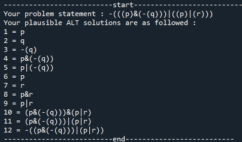

# alternatives_scaler_implicature
Algorithm for automated Computation of Structural Alternatives 

Sentences containing logical operators like “some” and “or” appear to be ambiguous between a basic meaning and a strengthened meaning. The mechanism to resolve this ambiguity is an alternative-sensitive computation– an ALT function produces a set of alternative sentences different from the utterance, and exh function which involves the denial of (some of) the alternatives produced by ALT. (Fox, D., & Katzir, R. (2011))
We have implemented the characterization of ALT proposed in Fox and Katzir (2011). We will integrate our ALT algorithms with the algorithm for computing EXH implemented by Mekik and Vertolli (2016). Together, this will automate the process of generating the strengthened meaning of sentences of arbitrary form and complexity.

The goal of our project is to produce fully implemented algorithms for computing ALT.  which we believe will have several potential benefits: 
1. allow researchers to quickly and easily test hypotheses about exh and ALT
2. they would help create AI systems for making human-like conversational inferences
3. they would provide concrete hypotheses about how exh and ALT might be computed in real time.

## Weak and Strong meaning 
Sentence: “Mary ate the apple or the ice-cream.” 
Basic Meaning: Mary ate at least one of them. 
Strengthened meaning— Also denying that Mary ate both.
How is the Strengthened meaning computed?

## Commonly assumed mechanism: 
Strengthened Meaning= exh(ALT(S))
ALT()- produces a set of alternative sentences different from the utterance
Exh()- denies some of the alternatives produced by ALT
Given the sentence above as input, ALT() produces Mary ate the apple and the ice-cream, and exh() negates the sentence, so that the utterance ends up conveying that Mary ate one of the apple or the orange, but not both. 

## Concerns regarding Complexity and Cognitive Plausibility
Where do the alternatives come from?
As sentences become more complex, the complexity of these computations have been argued to increase rapidly (Spector, 2016), raising questions about their psychological plausibility.

## The Algorithm 
This algorithm focus on inputs presented in Artificial language as defined as:
Any propositional variable is a sentence.
If p and q are sentences, so are: 
p ∧ q
p ∨ q

Rules for ALT set in above mentioned artificial language:
Replace any sentence T contained in S by a sentence that T contains
Replace ∧ by ∨ and vice-versa

We have implemented a specific algorithm in Python that computes this function. Our algorithm is currently limited to sentences in propositional logic, and assumes the syntax imposed by Python. The algorithm starts with the lowest node of the first branch it encounters as it reads the sentence from left to right. For every sentence that it encounters, it gathers the alternatives using the rules a) and b) . Thus, the set of alternatives grows as you climb the tree. In future work, we will extend the approach to first-order logic, we will implement a top-down variant, and we will integrate our ALT algorithms with the algorithm for computing O implemented by Mekik and Vertolli (2016). Together, this will automate the process of generating the strengthened meaning of sentences of arbitrary form and complexity.

Example: for sentence: -(((p)&(-(q)))|((p)|(r)))

## References
Fox, D., & Katzir, R. (2011). On the characterization of alternatives. Natural Language Semantics, 19(1), 87-107.
Mekik, C., & Vertolli, M. (2016, April). Towards Computer Implementations of exh. Retrieved March 24, 2017 from http://tom9semantics.wixsite.com/tom9/program
Spector, B. (2016). Multivalent semantics for vagueness and presupposition. Topoi, 35(1), 45-55.
